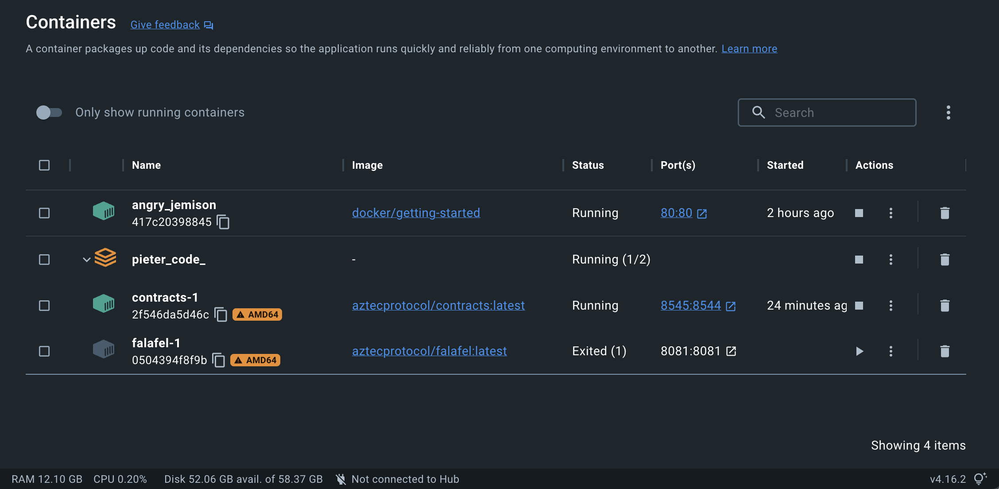

# Aztec Local Docker Devnet - macOS Developer Experience

###### tags: `Aztec Developer Relations` `Onboarding` `Local Devnet` `Docker` `macOS` `Setup` `Developer Experience` `DevEx` `DX`

### [Docs for setting up a local Aztec docker development environment](https://docs.aztec.network/developers/local-devnet)

- https://docs.aztec.network/developers/local-devnet

## Check your macOS system

This step is important in order to reproduce issues across different systems.

```shell=
$ sw_vers

ProductName:    macOS
ProductVersion: 13.2
BuildVersion:   22D49
```

```shell=
$ system_profiler SPSoftwareDataType SPHardwareDataType

Software:

    System Software Overview:

      System Version: macOS 13.2 (22D49)
      Kernel Version: Darwin 22.3.0
      Boot Volume: Macintosh HD
      Boot Mode: Normal
      Computer Name: my-computer
      User Name: my-user-name
      Secure Virtual Memory: Enabled
      System Integrity Protection: Enabled
      Time since boot: 0 hours, 00 minutes

Hardware:

    Hardware Overview:

      Model Name: MacBook Pro
      Model Identifier: MacBookPro18,4
      Model Number: Z15K0015YB/A
      Chip: Apple M1 Max
      Total Number of Cores: 10 (8 performance and 2 efficiency)
      Memory: 64 GB
      System Firmware Version: 8419.80.7
      OS Loader Version: 8419.80.7
      Serial Number (system): my-serial-number
      Hardware UUID: my-uuid
      Provisioning UDID:  my-udid
      Activation Lock Status: Enabled
```

## Install Docker

### Official Docker macOS references

- https://docs.docker.com/desktop/install/mac-install/

#### For M1 macOS machines

- [Mac with Apple silicon](https://docs.docker.com/desktop/install/mac-install/#mac-with-apple-silicon)

#### Test the Docker installion

```shell=
$ docker run -d -p 80:80 docker/getting-started

Unable to find image 'docker/getting-started:latest' locally
latest: Pulling from docker/getting-started
261da4162673: Pull complete
a60aada4c44a: Pull complete
2f61404bb4b8: Pull complete
fa3f58a317be: Pull complete
476bb2a1cc22: Pull complete
33a28b928e89: Pull complete
a879581b8e12: Pull complete
d0193f05f10f: Pull complete
14f901bbf056: Pull complete
Digest: sha256:d79336f4812b6547a53e735480dde67f8f8f7071b414fbd9297609ffb989abc1
Status: Downloaded newer image for docker/getting-started:latest
417c2039884598414cf7b7c05d74adad9d75c0ef309231f457a45296dce285e4
```

### Pull the Docker images for a Basic Aztec Network

Please refer to
- https://docs.aztec.network/developers/local-devnet#start-the-network
- https://docs.aztec.network/developers/local-devnet#basic-network

#### Initial run

For a simple, fresh Ethereum network + Aztec sequencer without any bridge contracts, run

```shell=
$ curl -s https://raw.githubusercontent.com/AztecProtocol/dev-rel/main/docker-compose.dev.yml | docker-compose -f - up --force-recreate
```

Docker Desktop should open up and look similar to this image



The terminal should display something similar to the following

```shell=

[+] Running 17/17
 ⠿ contracts Pulled                                                                                                                                              75.3s
   ⠿ eaead16dc43b Pull complete                                                                                                                                  24.9s
   ⠿ 4d8a471b1b4d Pull complete                                                                                                                                  40.4s
   ⠿ ec51fbb2d9d9 Pull complete                                                                                                                                  40.4s
   ⠿ 60159ec48203 Pull complete                                                                                                                                  40.5s
   ⠿ 604443ee96b5 Pull complete                                                                                                                                  60.5s
   ⠿ 9575eb2af3d8 Pull complete                                                                                                                                  60.8s
   ⠿ c0ce13e2339c Pull complete                                                                                                                                  60.9s
   ⠿ 18dec5c27d93 Pull complete                                                                                                                                  73.3s
   ⠿ c436bf8cfe61 Pull complete                                                                                                                                  73.7s
 ⠿ falafel Pulled                                                                                                                                                48.2s
   ⠿ 8921db27df28 Pull complete                                                                                                                                   1.8s
   ⠿ 0fa3bdf9cc11 Pull complete                                                                                                                                   7.9s
   ⠿ 092122bdc81d Pull complete                                                                                                                                   7.9s
   ⠿ bb654436a2bd Pull complete                                                                                                                                   8.0s
   ⠿ 123bfdeeebc3 Pull complete                                                                                                                                  25.8s
   ⠿ 1c2e2e0079a1 Pull complete                                                                                                                                  46.6s
[+] Running 3/2
 ⠿ Network pieter_code__default        Created                                                                                                                    0.0s
 ⠿ Container pieter_code_-contracts-1  Created                                                                                                                    0.3s
 ⠿ Container pieter_code_-falafel-1    Created                                                                                                                    0.0s
Attaching to pieter_code_-contracts-1, pieter_code_-falafel-1
pieter_code_-contracts-1  | Waiting for ethereum host at http://localhost:8544...
pieter_code_-contracts-1  | Created output directory
pieter_code_-contracts-1  | Deploying contracts from: 0xf39Fd6e51aad88F6F4ce6aB8827279cffFb92266
pieter_code_-falafel-1    | Waiting for contracts host at http://contracts:8547...
pieter_code_-contracts-1  | No files changed, compilation skipped
pieter_code_-contracts-1  | Script ran successfully.
pieter_code_-contracts-1  |
pieter_code_-contracts-1  | == Logs ==
pieter_code_-contracts-1  |   Dummy Defi Bridge: 0x3aa5ebb10dc797cac828524e59a333d0a371443c
pieter_code_-contracts-1  |   Sync Bridge: 0x322813fd9a801c5507c9de605d63cea4f2ce6c44
pieter_code_-contracts-1  |   Async Bridge: 0x09635f643e140090a9a8dcd712ed6285858cebef
pieter_code_-contracts-1  |   Contracts written to:
pieter_code_-contracts-1  |   serve/contract_addresses.json
pieter_code_-contracts-1  |   Deployer: 0xf39fd6e51aad88f6f4ce6ab8827279cfffb92266
pieter_code_-contracts-1  |   Safe         : 0x7095057a08879e09dc1c0a85520e3160a0f67c96
pieter_code_-contracts-1  |   ProxyAdmin   : 0xcf7ed3acca5a467e9e704c703e8d87f634fb0fc9
pieter_code_-contracts-1  |   Proxy        : 0xe0a7ae288de85f80d14258adb6322126054fa52a
pieter_code_-contracts-1  |   PermitHelper : 0x0165878a594ca255338adfa4d48449f69242eb8f
pieter_code_-contracts-1  |   ProxyDeployer: 0xdc64a140aa3e981100a9beca4e685f962f0cf6c9
pieter_code_-contracts-1  |   DefiProxy    : 0xe7f1725e7734ce288f8367e1bb143e90bb3f0512
pieter_code_-contracts-1  |   Verifier     : 0x5fbdb2315678afecb367f032d93f642f64180aa3
pieter_code_-contracts-1  |   FeeDistributor: 0x0000000000000000000000000000000000000000
pieter_code_-contracts-1  |   BridgeDataProvider  : 0xc3e53f4d16ae77db1c982e75a937b9f60fe63690
pieter_code_-contracts-1  |   GasPriceFeed  : 0xa82ff9afd8f496c3d6ac40e2a0f282e47488cfc9
pieter_code_-contracts-1  |   DaiPriceFeed  : 0x1613beb3b2c4f22ee086b2b38c1476a3ce7f78e8
pieter_code_-contracts-1  |   Faucet        : 0x851356ae760d987e095750cceb3bc6014560891c
pieter_code_-contracts-1  |   Version      : 2
pieter_code_-contracts-1  |
pieter_code_-contracts-1  | ## Setting up (1) EVMs.
pieter_code_-contracts-1  |
pieter_code_-contracts-1  | ==========================
pieter_code_-contracts-1  |
pieter_code_-contracts-1  | Chain 1337
pieter_code_-contracts-1  |
pieter_code_-contracts-1  | Estimated total gas used for script: 30364800
pieter_code_-contracts-1  |
pieter_code_-contracts-1  | Estimated amount required: 0.151824 ETH
pieter_code_-contracts-1  |
pieter_code_-contracts-1  | ==========================
pieter_code_-contracts-1  |
pieter_code_-contracts-1  | ###
pieter_code_-contracts-1  | Finding wallets for all the necessary addresses...
pieter_code_-contracts-1  | ##
pieter_code_-contracts-1  | Sending transactions [0 - 47].
pieter_code_-contracts-1  |
pieter_code_-contracts-1  | Transactions saved to: /usr/src/contracts/broadcast/E2ESetup.s.sol/1337/deploy-latest.json
pieter_code_-contracts-1  |
pieter_code_-contracts-1  | ##
pieter_code_-contracts-1  | Waiting for receipts.
pieter_code_-contracts-1  |
pieter_code_-contracts-1  | ##### dev
pieter_code_-contracts-1  |  [Success] Hash: 0x706be11d2e8b0b7d297c477fb5638363f4805a074080181723566c84e2bb1ae9
pieter_code_-contracts-1  | Contract Address: 0x5fbdb2315678afecb367f032d93f642f64180aa3
pieter_code_-contracts-1  | Block: 1
pieter_code_-contracts-1  | Paid: 0.003702003165215618 ETH (1112981 gas * 3.326205178 gwei)
pieter_code_-contracts-1  |
pieter_code_-contracts-1  |
pieter_code_-contracts-1  | ##### dev
pieter_code_-contracts-1  |  [Success] Hash: 0xb99a7ee1eb61f223d132cf181dbec0de52719cb8fc3d48a1f710f53132bfac58
...
pieter_code_-contracts-1  | Block: 2
pieter_code_-contracts-1  | Paid: 0.000193023012684518 ETH (58031 gas * 3.326205178 gwei)
pieter_code_-contracts-1  |
pieter_code_-contracts-1  |
pieter_code_-contracts-1  | ##### dev
pieter_code_-contracts-1  |  [Success] Hash: 0x6029658d165ab3bf3e272c293614912dd658701add758187d71226713f723b17
pieter_code_-contracts-1  | Contract Address: 0x2279b7a0a67db372996a5fab50d91eaa73d2ebe6
pieter_code_-contracts-1  | Block: 3
pieter_code_-contracts-1  | Paid: 0.017802013096709722 ETH (5352049 gas * 3.326205178 gwei)
pieter_code_-contracts-1  |
pieter_code_-contracts-1  |
pieter_code_-contracts-1  | ##### dev
pieter_code_-contracts-1  |  [Success] Hash: 0xdbc942af985a12c7ace2772d4d8eddc61f871f14002b4328eb0773c029bae8da
...
...
pieter_code_-contracts-1  | Block: 4
pieter_code_-contracts-1  | Paid: 0.000185532398623662 ETH (55779 gas * 3.326205178 gwei)
pieter_code_-contracts-1  |
pieter_code_-contracts-1  |
pieter_code_-contracts-1  | ##### dev
pieter_code_-contracts-1  |  [Success] Hash: 0x8120d239dd342cf8fd673b6963b1fd662c1d7e33e7bed5cd27dcfd62749154f0
pieter_code_-contracts-1  | Contract Address: 0x0b306bf915c4d645ff596e518faf3f9669b97016
pieter_code_-contracts-1  | Block: 5
pieter_code_-contracts-1  | Paid: 0.00391492686348011 ETH (1176995 gas * 3.326205178 gwei)
pieter_code_-contracts-1  |
pieter_code_-contracts-1  |
pieter_code_-contracts-1  | ##### dev
pieter_code_-contracts-1  |  [Success] Hash: 0x8850d2467454f36d815f2023d62fd4258171f804c2fe8e6697503b2bc07d8425
...
pieter_code_-contracts-1  | Block: 6
pieter_code_-contracts-1  | Paid: 0.000227422626635394 ETH (68373 gas * 3.326205178 gwei)
pieter_code_-contracts-1  |
pieter_code_-contracts-1  |
pieter_code_-contracts-1  | ##### dev
pieter_code_-contracts-1  |  [Success] Hash: 0x5235d7ee895c49471c8b579085d3d9b5e03039a38777f16add4b1b7ef209c2be
...
pieter_code_-contracts-1  | Contract Address: 0x09635f643e140090a9a8dcd712ed6285858cebef
pieter_code_-contracts-1  | Block: 7
pieter_code_-contracts-1  | Paid: 0.002264324153539034 ETH (680753 gas * 3.326205178 gwei)
pieter_code_-contracts-1  |
pieter_code_-contracts-1  |
pieter_code_-contracts-1  | ##### dev
pieter_code_-contracts-1  |  [Success] Hash: 0x2d979c77e11331637deab4bf7ddf711e83d451a651f003d5632154a537220de8
...
pieter_code_-contracts-1  | Contract Address: 0xa82ff9afd8f496c3d6ac40e2a0f282e47488cfc9
pieter_code_-contracts-1  | Block: 8
pieter_code_-contracts-1  | Paid: 0.000827047612688988 ETH (248646 gas * 3.326205178 gwei)
pieter_code_-contracts-1  |
pieter_code_-contracts-1  |
pieter_code_-contracts-1  | ##### dev
pieter_code_-contracts-1  |  [Success] Hash: 0x93bc98584e9607b49271e2da61074c1df3f2072820d7422c9681d845017ca8b3
pieter_code_-contracts-1  | Contract Address: 0x1613beb3b2c4f22ee086b2b38c1476a3ce7f78e8
pieter_code_-contracts-1  | Block: 9
pieter_code_-contracts-1  | Paid: 0.00082712744161326 ETH (248670 gas * 3.326205178 gwei)
pieter_code_-contracts-1  |
pieter_code_-contracts-1  |
pieter_code_-contracts-1  | ##### dev
pieter_code_-contracts-1  |  [Success] Hash: 0xef437a95d4143d0192d226daa44185b7c68e588ce1597001434e3c243087d3b3
pieter_code_-contracts-1  | Contract Address: 0x851356ae760d987e095750cceb3bc6014560891c
...
pieter_code_-contracts-1  | Block: 10
pieter_code_-contracts-1  | Paid: 0.00009516273014258 ETH (28610 gas * 3.326205178 gwei)
pieter_code_-contracts-1  |
pieter_code_-contracts-1  |
pieter_code_-contracts-1  | ##### dev
pieter_code_-contracts-1  |  [Success] Hash: 0x3225517f7b786e7f4999f26c00ac22ed5cf2ad951f67adaade932ca3f135c6a6
pieter_code_-contracts-1  | Block: 10
pieter_code_-contracts-1  | Paid: 0.000095089553628664 ETH (28588 gas * 3.326205178 gwei)
pieter_code_-contracts-1  |
pieter_code_-contracts-1  |
pieter_code_-contracts-1  | Transactions saved to: /usr/src/contracts/broadcast/E2ESetup.s.sol/1337/deploy-latest.json
pieter_code_-contracts-1  |
pieter_code_-contracts-1  |
pieter_code_-contracts-1  |
pieter_code_-contracts-1  | ==========================
pieter_code_-contracts-1  |
pieter_code_-contracts-1  | ONCHAIN EXECUTION COMPLETE & SUCCESSFUL.
pieter_code_-contracts-1  | Total Paid: 0.076875892705330176 ETH (23112192 gas * avg 3.326205178 gwei)
pieter_code_-contracts-1  |
pieter_code_-contracts-1  | Transactions saved to: /usr/src/contracts/broadcast/E2ESetup.s.sol/1337/deploy-latest.json
pieter_code_-contracts-1  |
pieter_code_-contracts-1  | Serving contracts output on 8547
pieter_code_-falafel-1    | ROLLUP_CONTRACT_ADDRESS=0xe0A7aE288De85f80D14258AdB6322126054fa52a
pieter_code_-falafel-1    | FAUCET_CONTRACT_ADDRESS=0x851356ae760d987E095750cCeb3bC6014560891C
pieter_code_-falafel-1    | PERMIT_HELPER_CONTRACT_ADDRESS=0x0165878A594ca255338adfa4d48449f69242Eb8F
pieter_code_-falafel-1    | FEE_DISTRIBUTOR_ADDRESS=0x0000000000000000000000000000000000000000
pieter_code_-falafel-1    | GAS_PRICE_FEED_CONTRACT_ADDRESS=0xa82fF9aFd8f496c3d6ac40E2a0F282E47488CFc9
pieter_code_-falafel-1    | DAI_PRICE_FEED_CONTRACT_ADDRESS=0x1613beB3B2C4f22Ee086B2b38C1476A3cE7f78E8
pieter_code_-falafel-1    | BRIDGE_DATA_PROVIDER_CONTRACT_ADDRESS=0xc3e53F4d16Ae77Db1c982e75a937B9f60FE63690
pieter_code_-falafel-1    | Waiting for ethereum host at http://contracts:8544...
```

```shell=
pieter_code_-falafel-1    | [2023-01-31T19:43:22.650Z] FeeCalculator:   -----------------------------------------------------------------------------
pieter_code_-falafel-1    | [2023-01-31T19:43:22.806Z] Server listening on port 8081.
pieter_code_-falafel-1    | [2023-01-31T19:43:22.812Z] Server: Initializing...
pieter_code_-falafel-1    | [2023-01-31T19:43:22.931Z] Downloading 8192 points from transcript00.dat...
pieter_code_-falafel-1    | [2023-01-31T19:43:24.354Z] Waiting for rollup_cli to bootstrap...
pieter_code_-falafel-1    | [2023-01-31T19:43:24.362Z] rollup_cli: Rollup CLI pid: 194
pieter_code_-falafel-1    | [2023-01-31T19:43:24.363Z] rollup_cli: Command line: ../../barretenberg/cpp/build/bin/rollup_cli ./data/crs 3 1 true false false ./data
pieter_code_-falafel-1    | [2023-01-31T19:43:24.364Z] rollup_cli: Txs per inner: 3
pieter_code_-falafel-1    | [2023-01-31T19:43:24.364Z] rollup_cli: Inners per root: 1
pieter_code_-falafel-1    | [2023-01-31T19:43:24.364Z] rollup_cli: Mock proofs: 1
pieter_code_-falafel-1    | [2023-01-31T19:43:24.364Z] rollup_cli: Lazy init: 0
pieter_code_-falafel-1    | [2023-01-31T19:43:24.364Z] rollup_cli: Persist: 0
pieter_code_-falafel-1    | [2023-01-31T19:43:24.364Z] rollup_cli: Data path: ./data
pieter_code_-falafel-1    | [2023-01-31T19:43:24.365Z] rollup_cli: Running in mock proof mode. Mock proofs will be generated!
pieter_code_-falafel-1    | [2023-01-31T19:43:24.365Z] rollup_cli: Loading crs...
pieter_code_-falafel-1    | [2023-01-31T19:43:24.366Z] rollup_cli: Getting account circuit data...
pieter_code_-falafel-1    | [2023-01-31T19:43:24.367Z] rollup_cli: qemu: uncaught target signal 11 (Segmentation fault) - core dumped
pieter_code_-falafel-1    | [2023-01-31T19:43:24.374Z] Error: Failed to initialize rollup_cli.
pieter_code_-falafel-1    |     at CliProofGenerator.start (file:///usr/src/yarn-project/halloumi/src/proof_generator/cli_proof_generator.ts:92:13)
pieter_code_-falafel-1    |     at processTicksAndRejections (node:internal/process/task_queues:95:5)
pieter_code_-falafel-1    |     at Server.start (file:///usr/src/yarn-project/falafel/src/server.ts:157:5)
pieter_code_-falafel-1    |     at main (file:///usr/src/yarn-project/falafel/src/index.ts:47:3)
pieter_code_-falafel-1 exited with code 1
```

#### Second run

```shell=
...
pieter_code_-contracts-1  | ==========================
pieter_code_-contracts-1  |
pieter_code_-contracts-1  | ONCHAIN EXECUTION COMPLETE & SUCCESSFUL.
pieter_code_-contracts-1  | Total Paid: 0.07687580619639552 ETH (23112192 gas * avg 3.326201435 gwei)
pieter_code_-contracts-1  |
pieter_code_-contracts-1  | Transactions saved to: /usr/src/contracts/broadcast/E2ESetup.s.sol/1337/deploy-latest.json
pieter_code_-contracts-1  |
pieter_code_-contracts-1  | Serving contracts output on 8547
pieter_code_-falafel-1    | ROLLUP_CONTRACT_ADDRESS=0xe0A7aE288De85f80D14258AdB6322126054fa52a
pieter_code_-falafel-1    | FAUCET_CONTRACT_ADDRESS=0x851356ae760d987E095750cCeb3bC6014560891C
pieter_code_-falafel-1    | PERMIT_HELPER_CONTRACT_ADDRESS=0x0165878A594ca255338adfa4d48449f69242Eb8F
pieter_code_-falafel-1    | FEE_DISTRIBUTOR_ADDRESS=0x0000000000000000000000000000000000000000
pieter_code_-falafel-1    | GAS_PRICE_FEED_CONTRACT_ADDRESS=0xa82fF9aFd8f496c3d6ac40E2a0F282E47488CFc9
pieter_code_-falafel-1    | DAI_PRICE_FEED_CONTRACT_ADDRESS=0x1613beB3B2C4f22Ee086B2b38C1476A3cE7f78E8
pieter_code_-falafel-1    | BRIDGE_DATA_PROVIDER_CONTRACT_ADDRESS=0xc3e53F4d16Ae77Db1c982e75a937B9f60FE63690
pieter_code_-falafel-1    | Waiting for ethereum host at http://contracts:8544...
pieter_code_-falafel-1    | (node:187) ExperimentalWarning: Importing JSON modules is an experimental feature and might change at any time
pieter_code_-falafel-1    | (Use `node --trace-warnings ...` to show where the warning was created)
pieter_code_-falafel-1    | [2023-01-31T20:44:30.289Z] Process Id: 187
pieter_code_-falafel-1    | [2023-01-31T20:44:30.292Z] Database Url: none (local sqlite)
pieter_code_-falafel-1    | [2023-01-31T20:44:30.292Z] Ethereum host: http://contracts:8544
pieter_code_-falafel-1    | [2023-01-31T20:44:30.293Z] Gas limit: 12000000
pieter_code_-falafel-1    | [2023-01-31T20:44:30.294Z] Call data limit: 122880
pieter_code_-falafel-1    | [2023-01-31T20:44:30.299Z] Signing address: 0xf39Fd6e51aad88F6F4ce6aB8827279cffFb92266
pieter_code_-falafel-1    | [2023-01-31T20:44:30.304Z] Rollup contract address: 0xe0A7aE288De85f80D14258AdB6322126054fa52a
pieter_code_-falafel-1    | [2023-01-31T20:44:30.309Z] Permit Helper contract address: 0x0165878A594ca255338adfa4d48449f69242Eb8F
pieter_code_-falafel-1    | [2023-01-31T20:44:30.316Z] Rollup fee beneficiary: 0x0000000000000000000000000000000000000000
pieter_code_-falafel-1    | [2023-01-31T20:44:30.318Z] Fee paying asset ids: 0,1
pieter_code_-falafel-1    | [2023-01-31T20:44:30.329Z] Price feed addresses: 0xa82fF9aFd8f496c3d6ac40E2a0F282E47488CFc9,0x1613beB3B2C4f22Ee086B2b38C1476A3cE7f78E8
pieter_code_-falafel-1    | [2023-01-31T20:44:30.329Z] Proverless: true
pieter_code_-falafel-1    | [2023-01-31T20:44:30.333Z] Bridge data provider address: 0xc3e53F4d16Ae77Db1c982e75a937B9f60FE63690
pieter_code_-falafel-1    | [2023-01-31T20:44:30.336Z] Falafel version: 2.1.5
pieter_code_-falafel-1    | [2023-01-31T20:44:30.773Z] Contracts: Initialising supported assets...
pieter_code_-falafel-1    | [2023-01-31T20:44:31.213Z] Contracts: Supported assets: ETH,DAI,BTC
pieter_code_-falafel-1    | [2023-01-31T20:44:31.215Z] EthereumBlockchain: Initializing blockchain status...
pieter_code_-falafel-1    | [2023-01-31T20:44:31.543Z] EthereumBlockchain: Seeking latest rollup...
pieter_code_-falafel-1    | [2023-01-31T20:44:31.654Z] EthereumBlockchain: No rollup found, assuming pristine state.
pieter_code_-falafel-1    | [2023-01-31T20:44:31.695Z] EthereumBlockchain: Initialized.
pieter_code_-falafel-1    | [2023-01-31T20:44:33.090Z] FeeCalculator: Creating...
pieter_code_-falafel-1    | [2023-01-31T20:44:33.097Z] FeeCalculator:   DEPOSIT for ETH call data: 281, adj/base gas: 166667/166667, tx gas: 19668, max/quoted txs per rollup: 3/3
pieter_code_-falafel-1    | [2023-01-31T20:44:33.098Z] FeeCalculator:   TRANSFER for ETH call data: 129, adj/base gas: 166667/166667, tx gas: 6736, max/quoted txs per rollup: 3/3
pieter_code_-falafel-1    | [2023-01-31T20:44:33.098Z] FeeCalculator:   WITHDRAW_TO_WALLET for ETH call data: 185, adj/base gas: 166667/166667, tx gas: 17632, max/quoted txs per rollup: 3/3
pieter_code_-falafel-1    | [2023-01-31T20:44:33.099Z] FeeCalculator:   WITHDRAW_HIGH_GAS for ETH call data: 185, adj/base gas: 166667/166667, tx gas: 47632, max/quoted txs per rollup: 3/3
pieter_code_-falafel-1    | [2023-01-31T20:44:33.101Z] FeeCalculator:   ACCOUNT for ETH call data: 129, adj/base gas: 166667/166667, tx gas: 4624, max/quoted txs per rollup: 3/3
pieter_code_-falafel-1    | [2023-01-31T20:44:33.102Z] FeeCalculator:   DEFI_DEPOSIT for ETH call data: 129, adj/base gas: 166667/166667, tx gas: 7504, max/quoted txs per rollup: 3/3
pieter_code_-falafel-1    | [2023-01-31T20:44:33.103Z] FeeCalculator:   DEFI_CLAIM for ETH call data: 129, adj/base gas: 166667/166667, tx gas: 2064, max/quoted txs per rollup: 3/3
pieter_code_-falafel-1    | [2023-01-31T20:44:33.103Z] FeeCalculator:   -----------------------------------------------------------------------------
pieter_code_-falafel-1    | [2023-01-31T20:44:33.103Z] FeeCalculator:   DEPOSIT for DAI call data: 281, adj/base gas: 166667/166667, tx gas: 19668, max/quoted txs per rollup: 3/3
pieter_code_-falafel-1    | [2023-01-31T20:44:33.104Z] FeeCalculator:   TRANSFER for DAI call data: 129, adj/base gas: 166667/166667, tx gas: 6736, max/quoted txs per rollup: 3/3
pieter_code_-falafel-1    | [2023-01-31T20:44:33.104Z] FeeCalculator:   WITHDRAW_TO_WALLET for DAI call data: 185, adj/base gas: 166667/166667, tx gas: 62632, max/quoted txs per rollup: 3/3
pieter_code_-falafel-1    | [2023-01-31T20:44:33.104Z] FeeCalculator:   WITHDRAW_HIGH_GAS for DAI call data: 185, adj/base gas: 166667/166667, tx gas: 62632, max/quoted txs per rollup: 3/3
pieter_code_-falafel-1    | [2023-01-31T20:44:33.105Z] FeeCalculator:   ACCOUNT for DAI call data: 129, adj/base gas: 166667/166667, tx gas: 4624, max/quoted txs per rollup: 3/3
pieter_code_-falafel-1    | [2023-01-31T20:44:33.105Z] FeeCalculator:   DEFI_DEPOSIT for DAI call data: 129, adj/base gas: 166667/166667, tx gas: 7504, max/quoted txs per rollup: 3/3
pieter_code_-falafel-1    | [2023-01-31T20:44:33.106Z] FeeCalculator:   DEFI_CLAIM for DAI call data: 129, adj/base gas: 166667/166667, tx gas: 2064, max/quoted txs per rollup: 3/3
pieter_code_-falafel-1    | [2023-01-31T20:44:33.106Z] FeeCalculator:   -----------------------------------------------------------------------------
pieter_code_-falafel-1    | [2023-01-31T20:44:33.139Z] Server listening on port 8081.
pieter_code_-falafel-1    | [2023-01-31T20:44:33.140Z] Server: Initializing...
pieter_code_-falafel-1    | [2023-01-31T20:44:33.337Z] Downloading 8192 points from transcript00.dat...
pieter_code_-falafel-1    | [2023-01-31T20:44:34.695Z] Waiting for rollup_cli to bootstrap...
pieter_code_-falafel-1    | [2023-01-31T20:44:34.733Z] Error: Failed to initialize rollup_cli.
pieter_code_-falafel-1    |     at CliProofGenerator.start (file:///usr/src/yarn-project/halloumi/src/proof_generator/cli_proof_generator.ts:92:13)
pieter_code_-falafel-1    |     at processTicksAndRejections (node:internal/process/task_queues:95:5)
pieter_code_-falafel-1    |     at Server.start (file:///usr/src/yarn-project/falafel/src/server.ts:157:5)
pieter_code_-falafel-1    |     at main (file:///usr/src/yarn-project/falafel/src/index.ts:47:3)
```
#### Potential Issues

```shell=
pieter_code_-falafel-1    | [2023-01-31T20:44:33.106Z] FeeCalculator:   -----------------------------------------------------------------------------
pieter_code_-falafel-1    | [2023-01-31T20:44:33.139Z] Server listening on port 8081.
pieter_code_-falafel-1    | [2023-01-31T20:44:33.140Z] Server: Initializing...
pieter_code_-falafel-1    | [2023-01-31T20:44:33.337Z] Downloading 8192 points from transcript00.dat...
pieter_code_-falafel-1    | [2023-01-31T20:44:34.695Z] Waiting for rollup_cli to bootstrap...
pieter_code_-falafel-1    | [2023-01-31T20:44:34.733Z] Error: Failed to initialize rollup_cli.
pieter_code_-falafel-1    |     at CliProofGenerator.start (file:///usr/src/yarn-project/halloumi/src/proof_generator/cli_proof_generator.ts:92:13)
pieter_code_-falafel-1    |     at processTicksAndRejections (node:internal/process/task_queues:95:5)
pieter_code_-falafel-1    |     at Server.start (file:///usr/src/yarn-project/falafel/src/server.ts:157:5)
pieter_code_-falafel-1    |     at main (file:///usr/src/yarn-project/falafel/src/index.ts:47:3)
```

### [TODO!!] Check the Sequencer 

As per the documentation [here](https://docs.aztec.network/developers/local-devnet#check-the-sequencer).
- https://docs.aztec.network/developers/local-devnet#check-the-sequencer

Check that the aztec sequencer (falafel) is running by visiting this url in your browser at 

- http://localhost:8081/status

Once it is up and running, you can use it to run testing scripts against or point your web application to it for testing.

